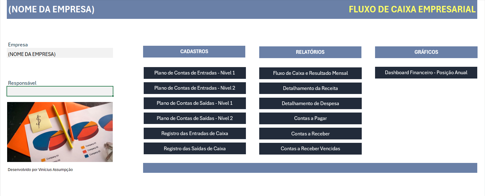
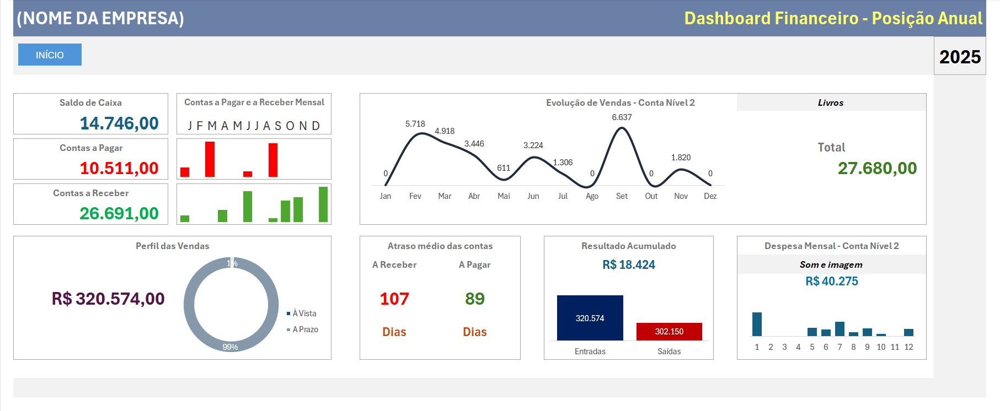
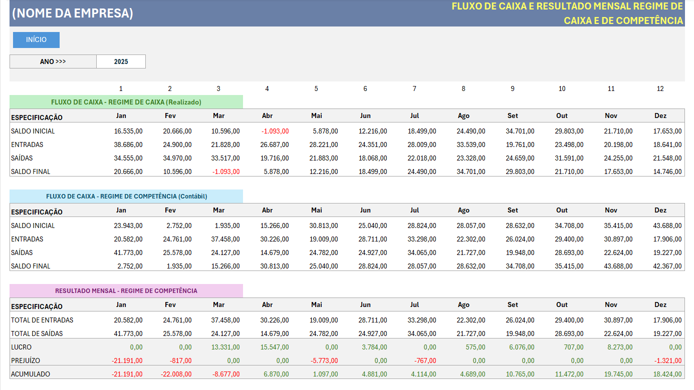
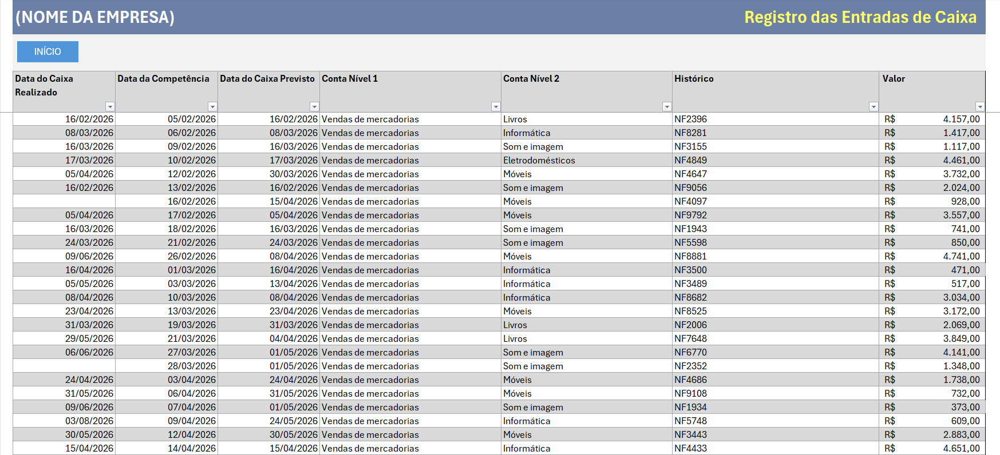

# Sistema de Fluxo de Caixa em Excel

Projeto desenvolvido durante um curso de Excel Avançado, com foco na aplicação prática de recursos profissionais do Microsoft Excel para gerenciamento financeiro empresarial.

📌 Funcionalidades

- Cadastro de receitas e despesas
- Plano de contas (Nível 1 e Nível 2)
- Registro de entradas e saídas
- Fluxo de Caixa
- Regime de Caixa
- Regime de Competência
- Contas a pagar
- Contas a receber
- Dashboard Financeiro

## Recursos do Excel utilizados

- Tabelas Estruturadas
- Validação de Dados
- Listas Suspensas Dependentes
- SOMASES
- Tabelas Dinâmicas
- Gráficos
- Dashboards
- Formatação Condicional

---

## Tela Inicial

---

## Dashboard Financeiro

---

## Fluxo de Caixa e Resultado Mensal

---

## Registro de Entradas

---

## Tecnologias

- Microsoft Excel

## Observação

Este projeto foi desenvolvido como parte de um curso de Excel Avançado e publicado como portfólio para demonstrar conhecimentos em modelagem de planilhas, dashboards e análise de dados.
